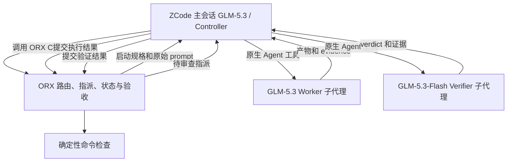

# ZCode 原生子代理作为 ORX 执行者：分析与建议

日期：2026-10-04。范围：分析当前源码、配置和官方能力，提出接入方案；不修改执行代码或用户配置。`dispatch.py` / `state.py` 在本次分析开始前已有未提交修改，工作区在分析期间也有其他编辑。以下按本次读取时的源码判断，并区分在建能力与已完整接入的能力；后续实施应重新检查最新版本。

## 结论

推荐支持 **host 驱动的原生 subagent 执行模式**。主会话仍是 ZCode GLM-5.3 Controller，worker 是其 GLM-5.3 子代理，verifier 是另一个 GLM-5.3-Flash 子代理。ORX 管理指派、执行事实和验收；ZCode 启动和运行子代理。这条路线不需要 ORX 能从 Python 启动 ZCode，也不需要等待 ZCode 的 headless CLI。

当前不是完全没有 subagent 支持：controller skill 已要求启动子代理。但这只是宿主操作协议，尚未形成可检查模型选择、绑定执行者、拒绝过期提交的完整执行契约。

## 1. 官方能力与未验证边界

ZCode 官方文档确认子代理具有独立上下文，可以指定具体模型、工具权限和思考档位。定义文件的档位字段是 `thoughtLevel`，只有指定具体模型时生效；配置改变需要新会话。自定义子代理仍为 Beta 灰度，子代理不能再派发子代理。[子智能体官方文档](https://zcode.z.ai/cn/docs/subagents)

官方模型文档列出 GLM-5.3 与 GLM-5.3-Flash，实际可用性取决于账号权限。GLM-5.3 的档位是 low / high / max；没有证据保证 Flash 具有同样档位，也没有核实本地子代理定义要求的完整模型标识。[连接模型官方文档](https://zcode.z.ai/cn/docs/configuration)

官方 Plugin 文档支持分发 agents 和 skills，适合作为后续安装路径。[Plugin 官方文档](https://zcode.z.ai/cn/docs/plugin)

尚未实测：本机是否已开放自定义 agent、Flash 是否在该账号可选、主 Agent 是否能可靠指定角色、子代理实际模型回执、子代理取消/恢复及工作目录选择。不能把其他宿主的 collaboration API 当成 ZCode API。这里按用户当前没有可用 ZCode CLI 的条件设计，不断言所有 ZCode 版本均不存在 CLI。

## 2. ORX 当前具有的基础

| 层 | 当前事实 | 对本需求的意义 |
| --- | --- | --- |
| host dispatch | `run_slice` 将 host 任务置于 waiting_host，返回指派和 prompt 文件 | 能把任务交给当前 ZCode 会话，无需启动外部进程 |
| controller skill | 看到 host_required 就启动 subagent，原样传递指派；先 claim 再执行 | 子代理已经是约定的宿主操作方式 |
| worker | claim → complete/fail；complete 后进入 verification | 可以复用现有任务状态机 |
| verifier | host 检查返回 agent_required；verdict 由 verify submit 提交 | Flash 可以作为宿主启动的独立检查者 |
| profiles | driver / harness / model / class / effort；host+zcode 可用，cli+zcode 被拒绝 | 能声明期望，但不能自行启动或约束 ZCode |
| routing | 顺序、静态能力、健康状态筛选 | 可复用选择策略，但没有真实宿主能力握手 |

源码依据：[派发](../src/orx/dispatch.py)、[配置](../src/orx/config.py)、[路由](../src/orx/routing.py)、[controller skill](../skills/orx-controller/SKILL.md)、[agent skill](../skills/orx-agent/SKILL.md)、[职责边界](responsibilities.md)。

### 目前缺失的保证

1. **self 与 subagent 未区分。** 一个 host profile 不能表示究竟由主会话自己执行，还是调用某个指定子代理。
2. **指派不是完整启动规格。** host worker 的 payload 有 profile 名和 prompt，但没有完整模型、effort、原生 agent 名、工作目录、稳定 attempt 标识；恢复时信息更少。Controller 必须额外查配置并自行解释。
3. **期望模型不等于实际模型。** attempts.model 来自 profile，不是 ZCode 执行回执。host requested_effort 不会直接变成 ZCode 的 thoughtLevel 参数；当前宿主配置未被 ORX 校验。
4. **验证缺少派发时固定的身份。** host verify_dispatch 没有为检查创建持久 assignment / attempt；verify_submit 再次路由并创建 attempt。因此路由或健康状态变化后，结果可能归属另一 profile；重复派发也缺少“已执行中”的去重依据。
5. **恢复只有状态重现。** waiting_host 可以重新展示，但 running 子代理的查询、重连、取消和接管不完整。
6. **并行上限没有覆盖原生子代理。** effective_parallelism=1 约束 CLI 启动；host_required 可返回多个任务，Controller 若全部启动，仍可能共享工作区并发写。
7. **自动升档不是现有机制。** 路由按可用性选第一个 profile，不依据语义难度或失败次数自动升级。当前 task retry、verify CLI 也没有单任务 --profile 接口；文档中的“pin 下一档”与实际命令面存在差距。

## 3. 推荐责任划分

主会话选择由 ZCode 完成；`controller.profile` 是 ORX 对宿主的期望，不会切换当前聊天模型。Worker 与 verifier 均为同一主会话下的兄弟子代理，调用 orx-agent 工作契约，不在子代理里运行完整 controller 循环。

第一版让 Controller 统一 claim、启动、接收和提交，子代理只生产交付与报告。这样状态变更有单一执行路径；将来若子代理直接提交，也必须通过同一指派身份校验。

不建议先把原生子代理塞进现有 CLI Adapter：它的核心接口是构造 argv / Launch / 进程输出解析，与宿主内部 Agent 调用不同。优先保留 driver=host，增加明确的 host execution mode 和 native agent selector；若未来获得真实外部启动接口，再增加对应执行 driver。避免仅为一个工具重写整个适配体系。

## 4. 配置设计

推荐提供一个 **ZCode preset**，作为该用户的默认配置；通用 ORX 不应假设每个宿主都是 ZCode。

| Profile（建议名称） | 角色 | 执行方式 | 期望模型 | class |
| --- | --- | --- | --- | --- |
| zcode-controller | Controller | 主会话 self | GLM-5.3 | strong |
| zcode-worker | Worker | 指定 worker 子代理 | GLM-5.3 | strong |
| zcode-verifier-flash | Verifier | 指定 verifier 子代理 | GLM-5.3-Flash | economy |
| zcode-verifier-strong | Verifier 升级 | 独立 verifier 子代理 | GLM-5.3 | strong |

host_mode=self/subagent 与 agent_ref 是建议新增的字段，不是当前可执行配置。当前配置加载器不识别这些语义，不能贴进去就宣称已接入。新增后应验证字段、角色和 selector；默认显式模型和档位不匹配时报错，只有用户配置了 fallback 才允许换模型。

ZCode 原生定义保存模型与 thoughtLevel，ORX profile 保存期望与路由；必须验证两者一致，避免形成两套互相漂移的事实。第一步可在客户端建立具体角色，再以它实际生成的定义为准；不要猜 provider-qualified model 标识。

按用户现有偏好，GLM-5.3 的 max 可保留为初始基线。Flash 使用客户端实际支持的档位。high/max 的优化另做同任务对照，不与 subagent 接入绑在一起。

### 三种“默认”必须分开

- **本仓库有效配置**：项目 worker 仍是 Cursor 优先，verify 仍是 Composer 优先；用户层没有 config.toml。用户 profile orx-host 的 model 仍为 unconfigured、class=strong、effort=max。这不等于期望的全 ZCode build/verify 默认。
- **orx init 模板**：所有角色使用 orx-host，但模板 profile 是 unconfigured、frontier、medium。GLM-5.3 不应因模板而被当成 frontier。
- **用户期望的 preset**：明确区分 controller / worker / verifier，指向真实子代理。当前 init 写出的同名项目 profile 会完整覆盖用户层 profile，项目 routing sections 也会覆盖用户默认；因此仅修改用户配置不能确保新项目采用 preset。

默认配置工作需要同时处理 preset 安装、init 行为和已有项目显式 override。不能悄悄覆盖已有项目；有效配置应可通过 config list / profiles / doctor 核对。

Planner 不在本次用户明确要求中，建议保留现有规划策略。若另外要求 deep planner 也使用 GLM-5.3，应保持 class=strong 并显式允许规划 class downgrade；不能伪标 frontier 绕过门槛。[路由策略](routing-strategy.md)、[init 模板](../src/orx/dispatch.py)、[配置合并](../src/orx/config.py)。

## 5. 运行契约：先确保派发与结果对应

所有 host 指派应有稳定的 run / revision / assignment / attempt 身份。Verifier 还要绑定具体 verification entry 和被审查的 worker attempt / 代码快照。

建议流程：

1. 路由选定 profile，保存执行配置快照，创建持久指派及尚未开始的 attempt。
2. Controller 认领，ORX 返回原始 prompt、项目根目录和 execution spec。
3. Controller 启动明确的原生 agent；记录可获得的子代理 handle、父会话、实际模型及来源。
4. 子代理产出 evidence 或 reason/verdict；Controller 按原指派提交。
5. ORX 检查该 revision / attempt 仍有效、role 与 entry 一致，幂等关闭执行记录；验证成功才可 passed。

不重新路由旧结果；重复提交不重复记账；旧 attempt 的晚到结果不能关闭新 attempt。模型、effort、usage 若仅来自配置，应标为 requested / configured；原生回执或真实请求观测才支持更强事实，agent 自称模型名称不是可靠确认。

当前工作区 M1.2 在建代码已加入 session_ref、run_id、host_report schema 基础。session_ref 目前取 ORX_SESSION_REF；停放时拿到的主会话标识不能自动当成 worker 子代理标识。应复用已有字段并补充父子关系，不重复发明另一套 ledger；CLI 全链路尚需独立核对。[状态存储](../src/orx/state.py)、[M1.2 计划](m1.2-plan.md)。

宿主断线后，对 running 子代理应先查询其原生状态。若没有公开可用查询接口，标记需要恢复处理，不能仅因超时就启动另一个写作者。取消请求与已确认取消也须区分。

## 6. Flash 验证和并行边界

Flash 适合作为默认 agent verifier 的候选，是否足够应由真实漏检率与验收效果决定。先运行计划指定的 compile/tests/lint，再让 Flash 审查命令难以证明的条件。不给 verifier 修复职责；输入应包含验收项、实际 diff、命令结果及 evidence，而非只听 worker 摘要。

独立子代理不等于完全独立错误来源。GLM-5.3 worker 与 Flash verifier 仍可能有相关盲点，V0 检查和必要的更强审查依然有价值。

`verify.profiles=[flash,strong]` 只表示可用性 fallback，不表示高风险检查必经 strong，也不表示 Flash 不确定就自动再审。要支持这些行为，需新增每项检查的路由策略或可用的定向升级接口；当前语法仅有 agent / agent[vision]。不能把文档 V1/V2/V3 当成已实现的自动分层。

工具层尽量给 verifier 只读能力。Bash 可修改文件，不能因提示词写了“只读”就记录成已强制 read_only；证据文件可由 Controller 保存。若验证需要运行命令，优先由 ORX 执行原定命令或提供实际隔离能力。

第一版写入 worker 串行，即使 ZCode 支持并行。主会话可保持小上下文：保留任务状态、决策与证据引用，把具体实现留给子代理。并行读审查需要冻结同一结果；并行写入需要 worktree、集成和重新验证，是后续独立阶段。

## 7. 三阶段推进建议

| 阶段 | 交付 | 验收 |
| --- | --- | --- |
| A：原生能力实测与 preset | 建立 worker / Flash verifier 角色，核对真实 model 与 thoughtLevel，新会话完成最小任务 | 独立上下文；真实 Flash 执行记录可确认；worker 不派发下级 agent；V0+agent verdict 完整回传 |
| B：ORX 执行契约 | host mode / selector、完整 payload、verifier 持久 assignment、按身份提交、实际设置来源、有效配置检查 | 重复派发不重复执行；派发后修改路由不改变结果归属；过期提交拒绝；模型不匹配可见；旧 host/CLI/external 行为仍有效 |
| C：可靠性与交付 | 用户默认 preset、无覆盖安装/更新、断线处理、可选 Plugin 分发 | init 尊重用户 preset；已有项目 override 保留；角色定义与 profiles 可检查一致；恢复不制造第二写作者 |

阶段 B 使用本项目现有 pytest 和 fake executor，先写行为测试，再实现；不需要用付费模型跑单元测试。真机测试只负责验证 ZCode 能力和实际模型选择。MCP 是可选接入表面，不是当前方案的前置条件：ZCode 已能通过终端调用 ORX CLI；MCP 本身也不会替 ORX 获得启动 ZCode 子代理的能力。

## 8. 对前一段分析的修正

“host effort 目前只记账”在 ORX 现有代码上成立；但“只能切主会话全局档位”不完整：原生子代理定义允许独立设置，ORX 可通过调用该角色间接落实，不必等待 CLI。

此前贴出的 SQLite 统计没有在本次重新取数，不能作为本次实测。缓存 token 占比也不能单独证明 max 思考开销很小、不存在隐藏计费或 high 一定更快；这些需要提供商计量口径和对照数据。先落实执行归属，才能可信地比较角色、模型与档位。

## 本次核查

读取当前源码、仓库技能、项目与用户 TOML，并核对官方文档；外部能力详见[研究记录](zcode-capabilities-research.md)。未修改运行中的 Goal、state.db、用户 ZCode 角色、路由配置或代码。

执行 `uv run --offline pytest -q tests/test_assignments.py tests/test_verify.py tests/test_config.py tests/test_routing.py`：78 passed in 5.07s。这些测试验证已有 ORX 行为，不等于 ZCode 原生集成已经通过实测。本文提出的新增契约尚未实现。

阶段 A（原生能力实测）已于同日执行，"尚未实测"清单中可会话内验证的项均已闭环，结果见 [zcode-subagent-verification.md](zcode-subagent-verification.md)。
